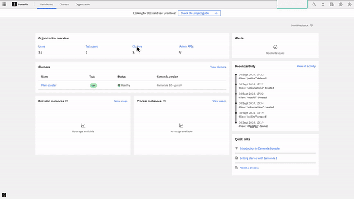

# Tool for Testing Camunda 8 SaaS Connections

https://jira.camunda.com/browse/ACADEMY-3286

## Purpose

You need to ensure that you can connect to Camunda 8 SaaS as a prerequisite for a Camunda 8 training for developers.
This tool provides a script that will verify the connection.

## Script Files

There are two scripts, depending on your machine:

- Unix-like systems: `scripts/testConnection.sh`
- Windows systems: `scripts/testConnection.ps1`

## Dependencies

These scripts are designed for ease of use without requiring additional software installation.
They use built-in functions that are standard in Unix and Windows systems.

The scripts require a file called `envVars.txt` containing environment variables necessary for the connection to Camunda 8 SaaS.
Ensure that this file is placed in the same directory as the script.

## How to Use

1. Paste the `envVars.txt`(\*) file into the same directory as the script.
2. Run the script:
   - **Windows**: Open PowerShell and run `./testConnection.ps1`
   - **Mac/Unix**: Open the terminal and run `./testConnection.sh`
3. Review the result for success or failure.

**(\*) Note**: You can create the `envVars.txt` if you have access to `camunda.io`:

- Sign up at [Camunda.io](https://camunda.io) and [create an API client](https://docs.camunda.io/docs/components/console/manage-clusters/manage-api-clients/#create-a-client).
- Download the Client Credentials in environment variables (`export VAR_NAME='value'`).

  

- Convert this file to the required format (`VAR_NAME=value`). You can optionally use the provided `script/convertToEnvVar.(sh/ps1)`.

## Connection Result

The script will test your connection to Camunda 8 SaaS and provide one of the following outcomes:

- **Success**: If a valid response is received from Camunda 8 SaaS and 3 brokers (with nodeId 0, 1, and 2) are detected, the script will print `***** OK *****` along with connection details.
  This confirms a successful connection.
  You'll be able to do the training exercises.
- **Failure**: If the connection cannot be established, or fewer than 3 brokers are detected, the script will print `***** CONNECTION FAILED *****`.
  Potential causes of failure include:

  - Missing or incorrect environment variables.
  - Invalid access token or authorization issues.
  - Network or endpoint connectivity problems.

  In case of failure, please contact your training manager with the error details.

## Tested Environments

These tools have been tested in these environments:

- Macbook Pro Sonoma 14.7
- Windows Server 2022 Datacenter Version 21H2
- Ubuntu 22
- Amazon Linux AWS
- Red Hat
